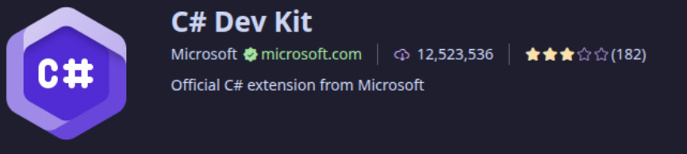
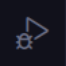
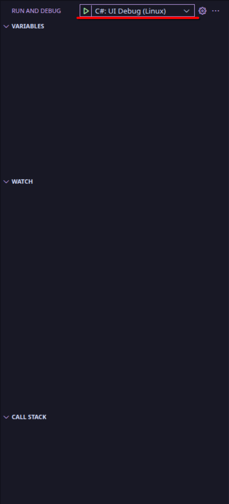
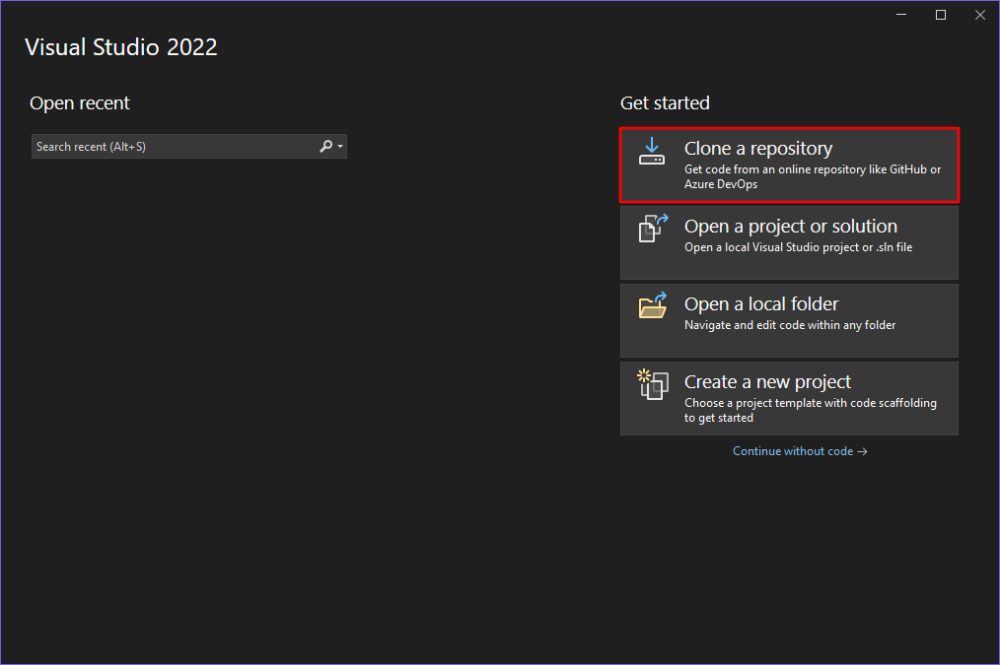
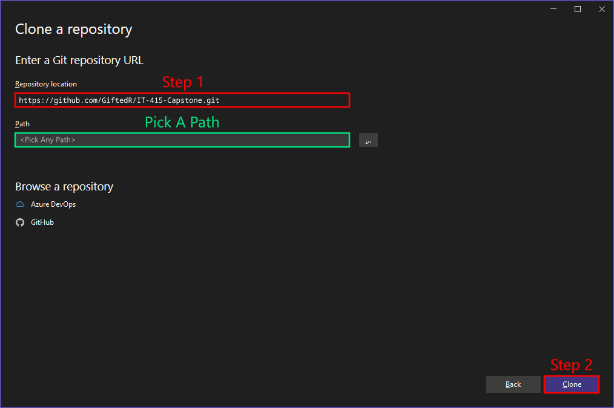
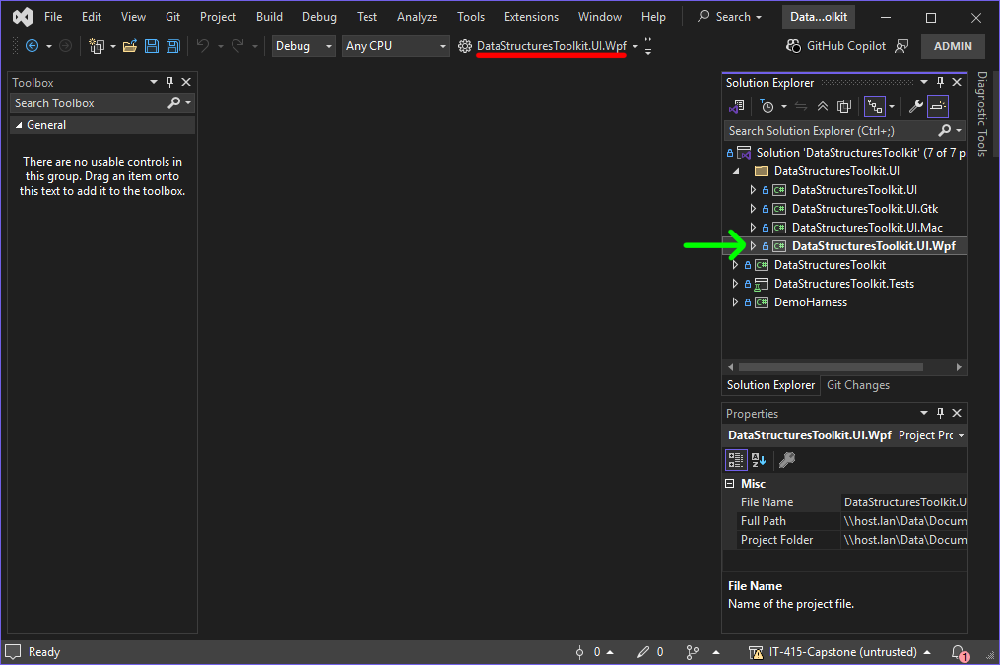

# Data Structures Toolkit

_[Types have been moved](DATATYPES.md)_

## What
Data structures Toolkit (DST) is a library of common data types to be used as a quick access to source code, being able to easily modify it to specific needs.

## Why

DST was made as a part of IT415 class, each week iterating on the previous to create a larger project. The final week was a free reign to expand on what we believed we needed. This is where the UI Project came from.

## Who

Me (:

_There is some code we were forced to start with, but names were changed and strict types were enforced which caused alot of change._

## How

Running the project is quite simple, and only varies slightly between platforms.

### Using VSCode

This is the reccomended way, and can be used between each Windows, Mac, and Linux.

#### Installing dependencies

__Git__ - Git is a Version control system that can be used to backup and track iterative changes within the codebase.
It can be found [Here](https://git-scm.com/install/) or on your Operating Systems Package Manager.

__.NET__ - .NET is a C# framework for building apps. It can be found [Here](https://dotnet.microsoft.com/en-us/download). This project used Net8 so thats the one you need to install [Here](https://dotnet.microsoft.com/en-us/download/dotnet/8.0).

__VSCode__ - The text editor, it is cross platform and very powerful. It can be found [Here](https://code.visualstudio.com/download), or in some package managers. _There is also a web version [here](https://vscode.dev/), but it is not recomended._

#### Getting the project

__Using your terminal of choice, navigate to the folder you want the project to be.__

This can be done with 
> cd \<path to folder\>

_~ can be used as the home folder on Mac and Linux._

__After making the decision of where you want the project to go, you can then create a copy of the project by using the command__

> git clone https://github.com/GiftedR/IT-415-Capstone.git

__This will create a local copy of the project into a folder labelled "IT-415-Capstone"__

#### Opening the Project

__You can then open the project by typing__

> code IT-415-Capstone/

-or-

> cd IT-415-Capstone

then

> code .

__WARNING: Typing a / instead of a . will open every file with VSCode!__

#### Running the Project

__VSCode might ask you to install extensions for C#, if it does so, there are 2 that you need.__

1. C#

2. C# Dev Kit _(This is for running the Tests)_

_These are only available on the VSCode build from microsoft, the alternative VSCodium won't have these and have extensions that might be missing features._

__Following this, there should be a an icon on the left labelled "Run and Debug".__

__Clicking this will bring up a panel with a green play button at the top.__

__If it has your platform of choice next to it (Windows, Mac, or Linux) you can run it by hitting the play button, or pressing F5.__

_If it doesn't say your platform, click the text labelled with "C#" and find your platform from the list that pops up._

__Give it a little bit of time and it should start up.__

_You can also run the project without using vscode, by going into any of the the folders with a Program.cs using the cd command and typing "dotnet run"._

### Using Visual Studio 2022

_Ensure you have the _

__Click Clone a repository__

__Enter the url to this repository under Repository location.__

> https://github.com/GiftedR/IT-415-Capstone.git

__Enter a location to a folder on your pc to clone the repository into. (_This is the pick a path box_)__

__Then click clone to clone the repository and open it__

__To run the project click the green arrow at the top to run the app. (_If it does not say DataStructuresToolkit.Launch with your platform, click the little arrow pointing down and select it from that menu._)__

___If its not in that menu, you will have to set it up as the startup project, by clicking the folder labelled "DataStructuresToolkit.UI" in the Solution Explorer, right clicking the DataStructuresToolkit.UI.Wpf and Click "Set As Startup Project"___

__Now you should see it and be able to run it.__