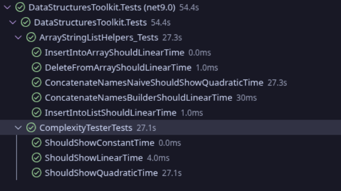
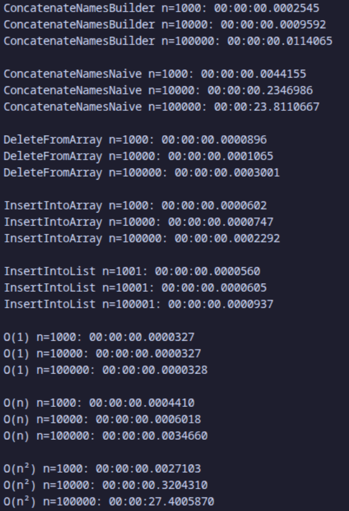
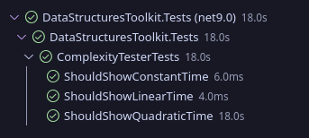
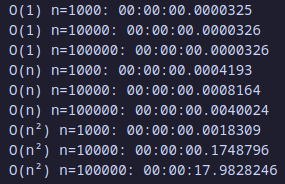

# Reflection

## Week 10
1. I made the choice to extend with a graph feature as it seemed mode useful to have rather than a set feature. In this case, the graph can be used for items that require a distance between them or for relationships. There are two main use cases for the graph. The first major one is for map traversal, like Google Maps or Apple Maps. Where then searches can use the structure to efficiently search for directions and distances between places. The other is for databases. These are Graph Databases and are often used for personalized recommendations for users.

The benchmark between the List and Hashset demonstrated a massive trade off. When searching for a Million items the Hashset found the correct item within 2700 nanoseconds, while the List searching the same list it took 5.638 milliseconds (5,638,000 nanoseconds), Both of these lists had the item to search for directly in the middle. While this different may not seem like much, when searching for billions or trillions of items it can get very costly if done incorrectly.

Choosing an option over the other doesn't affect clarity or efficiency of the showcase, it just adds more features to an ever expanding library. It also shows more examples of naming conventions and documentation comments.

## Week 9
1. I already had an inkling of how linked lists worked as I had played with them while using pointers. The main difference is that normal collective types use consecutive / heap based memory patterns. While lists use more reference or pointer based patterns. The ladder is faster as it doesn't require waiting in order for the system to allocate additional memory.

	When using these collections in practice, there is a good place for either. A circularly linked list can be used in most places a normal doubly linked list can, however, it is more beneficial to use the circular model as there are two references to the list. This means that the reference can be rebuilt if one of them are lost.

	This hasn't deepened my understanding of the referential data types as I already had a firm grasp on the structures and concepts we covered with this weeks work. In order for me to deepen my understanding, I would have to look into the correlation of these referential data structures in the context of special pointers. Like unique pointers or shared pointers.

	Although the assignment didn't increase my understanding, I did enjoy getting to play with generics and the complexities with comparison that occur from not having explicitly defined types.

## Week 8

1.  With collisions, the best way to handle them depends on the use case for the hash table. In our use case, it was preferred that they both end up relating to their keys. In other cases, it would be better to either throw an exception, or generate a unique id for each item. The ladder would allow for duplicates, but also require an extra bit of information when accessing the stored values.

	Built in implementations mainly diminish worries about bugs as they are already tested. They also can save time as they are already built into the language. 

	For most cases in real world projects, the default implementations cover most use cases. One is most likely to find custom build solutions as they get farther and farther from standard use cases. Like building an entire custom framework, or for designing a class around a specific programming paradigm like the builder pattern. The most common place to find custom implementations of these classes is in reference to game design. The game engine known as Godot uses a custom version of a dictionary known as the uid system, where uids refer to each file inside a project and can be used for looking up resources. This also is built to update when files are moved so paths don't need to be fixed, and puts less work on the developer.

2. A. Console Output
> Setting Alice with the phone number 555-1234...
>
> Setting Bob with the phone number 555-5678...
>
> Setting Charlie with the phone number 555-9012...
>
> David has a number is False
>
> Starting HashSet Demo:
>
> Inserting Apple into the HashSet
>
> Inserting Apple into the HashSet Again
>
> Current HashSet values:
>
> [ Apple ]

2. B. Test Output
> Simple Has Table State:
>
> [0] : []
>
> [1] : []
>
> [2] : [ 12,  22,  37, ]
>
> [3] : []
>
> [4] : []

## Week 5

1. The easiest methods to implement were the linear search and the binary search. This is because the idea behind them was simple enough to get written and debug if needed. This is in contrast to Quick Sort which wasn't as simple to debug. There was also an issue where stack overflows would out print the console buffer (Print so many lines that the useful information was hidden). This caused me to rewrite Quick sort with a more iterative approach instead of recursively.

When it came to the performance between them, quick sort was the fastest for sorting, and binary search was the fastest for searching. Although the first run through of the method was substantially higher than subsequent runs due to some of the ways the compiler handles the methods. Needing to cache the methods before being able to run them and such.

As for which algorithm I would use in the capstone, for the capstone of 415 all of them would be used because we are just turning in the current project. As for the capstone of the degree, I will probably use quick sort and binary search to allow for quicker saving and loading of custom project files that will be used.

## Week 3

1. When comparing the built in stack and queue vs my custom implementation. I would definately use the built in over mine in almost any situation. The main reason for this is that I don't have to stress about wheither or not the stack or queue has hidden bugs when building applications. The only time I would use the custom version is when I need to be able to look in the middle of the stack or queue. Like for an actual ticketing system, where its not just the first one that matters, but all of them ordered by priority.

## Week 2

1. InsertIntoArray

	a. The method inserts an item at a specified index.

	b. At the worst case it has to shift every item.

	c. has to shift the array before inserting
2. DeleteFromArray

	a. Deletes the item from a specified index.

	b. At the worst case it has to shift every item.

	c. Works very similarly to inserting
3. ConcatenateNamesNaive

	a. Merges an array of names into one string by looping over them.

	b. It loops over every item to add them together. To do this it needs to loop over every character to copy them over.

	c. Youre actuallu doing multiple concatinations to add commas between each item.
4. ConcatenateNamesBuilder

	a. Merges an array of names into one string by using a StringBuilder.

	b. It inserts into an already made array and grows as it needs to. At worst case it needs to copy all the characters into the new section.

	c. Trys to bypass allocation time by preallocating the space needed.
5. InsertIntoList

	a. Inserts an item into a list.

	b. It inserts into an already made array and grows as it needs to. At worst case it needs to copy into the new array.

	c. Trys to bypass allocation time by preallocating the space needed.

## Week 1
1. Constant Method

	a. The method returns the first item of the array.

	b. It is classified as O(1) because the time it takes is the same regardless of the size of the data being put into it.

	c. It stayed the same, It only adjusted by margin of error.

2. Linear Method

	a. The method loops through an array and determines whether or not to incude an input from the first array.
	
	b. It is classified as O(n) as it only loops through the array once.

	c. The difference in time was a 10x increase per step which matched the increase in the input size.

3. Quadratic Method

	a. The method adds the ascii value of each character matched with each other character in the string to give the word a score.
	
	b. It is classified as O(n²) because it loops through the data within a loop that is already looping the data.

	c. The time changed at a rate of 100x which matches the squared increase in the data size 10x²

